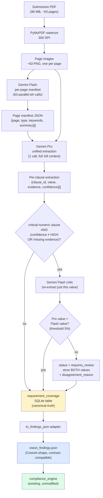

# Phase 3 — Vision Scanner: Design Proposal

**Status:** Draft for review. No code yet. Gates Phase 3 implementation kick-off.
**Date:** 2026-05-19
**Author:** Claude agent (under Lior's direction)
**Predecessor:** [`docs/phase_2b_completion.md`](./phase_2b_completion.md)
**Spec reference:** `docs/product_spec_v0.1.md § 6 (Vision Pipeline)` + extensions discussed in-session

---

## 1. Goal & scope

Replace the current placeholder for discipline findings (today: hand-curated Cowork JSON for the v24.3 pilot) with an **automated vision pipeline** that:

1. Reads any submission PDF
2. Locates and extracts each takanon (תקנון) clause's evidence within the submission
3. Writes a `vision_findings.json` file in the **existing engine-output contract shape** so `compliance_engine/` consumes it **with zero code changes**

The pipeline is built around two Gemini models:
- **Flash** — fast per-page classifier (page manifest) + critic pass for numerics
- **Pro** — single 1M-context pass over the full document for unified extraction

The two-model design is deliberate: Flash is cheap and high-throughput; Pro is expensive but produces consistent cross-page reasoning. The Flash critic on critical numerics gives us automatic disagreement detection without paying for two full Pro runs.

**Out of scope for Phase 3:** new engine rules, UI changes, DWG/KML/SHP parsing (Phase 4), production hardening of the signed `.app` bundle (Phase 5).

---

## 2. Data flow



**Reading the diagram:**

- **Yellow box** (`requirement_coverage`) — the canonical, append-only source of truth. Every model call writes a row here before any consumer reads.
- **Blue box** (`vision_findings.json`) — derived adapter output, regeneratable from the table at any time.
- **Green box** (engine) — existing code. Zero changes.

---

## 3. Folder layout

New top-level Python package alongside `compliance_engine/`. Same convention (process-isolated subprocess per ADR-001).

```
vision_scanner/
  __init__.py
  config.py                  # Gemini key resolution, model names, retries, timeouts
  rasterize.py               # PyMuPDF → list[Path] of page PNGs
  page_manifest.py           # Flash pass — page-level classification
  extract_requirements.py    # Pro pass — unified extraction across all pages
  critic.py                  # Flash critic pass — re-extract critical numerics
  disagreement.py            # diff logic: numeric tolerance, text normalization
  storage.py                 # SQLAlchemy model for requirement_coverage + migrations
  to_findings_json.py        # adapter: requirement_coverage rows → engine-shape JSON
  cli.py                     # python -m vision_scanner.cli scan PDF --submission-id N
  schemas/
    page_manifest.py         # Pydantic: PageManifestEntry
    extraction.py            # Pydantic: RequirementCoverageEntry, BBox
  tests/
    fixtures/
      v24.3_pages_1-5/       # small subset for unit tests; full PDF too big
    test_rasterize.py        # DPI, PNG validity, page count match
    test_page_manifest.py    # mocked Flash responses, schema validation
    test_disagreement.py     # tolerance logic, edge cases (None, NaN, unit mismatch)
    test_to_findings_json.py # adapter shape conformance to engine_output_contract.md
```

`vision_scanner/` is invoked by the sidecar as a subprocess (per ADR-001 — heavy ops never share the FastAPI event loop). The sidecar exposes a job type `vision_scan` whose worker shells out to `python -m vision_scanner.cli`.

---

## 4. Schemas

### 4.1 Page manifest (Pydantic)

```python
from enum import Enum
from typing import Literal
from pydantic import BaseModel, Field

class PageType(str, Enum):
    COVER = "cover"
    TOC = "toc"
    NARRATIVE = "narrative"      # textual explanation
    SCHEMATIC = "schematic"       # building section, elevation
    PLAN = "plan"                 # site plan, floor plan, plot layout
    TABLE = "table"               # tabular data (areas, units, etc.)
    APPENDIX = "appendix"
    UNKNOWN = "unknown"

class PageManifestEntry(BaseModel):
    """One entry per submission PDF page. Produced by Flash pass."""
    page_number: int = Field(..., ge=1)
    page_type: PageType
    summary_he: str = Field(..., max_length=400)
    keywords_he: list[str] = []
    booklet_clause_refs: list[str] = []   # best-effort: clause IDs touched
    has_numeric_data: bool                # quick filter for Pro pass
    confidence: Literal["HIGH", "MEDIUM", "LOW"]
    extraction_method: Literal["gemini_flash_v1"] = "gemini_flash_v1"
    raw_response_token_count: int | None = None
```

### 4.2 Requirement extraction (Pydantic)

```python
class BBox(BaseModel):
    page: int = Field(..., ge=1)
    x0: float; y0: float
    x1: float; y1: float

class RequirementCoverageEntry(BaseModel):
    """One row per (submission, takanon_clause_id) — UNIQUE pair."""
    takanon_clause_id: str                # e.g., "2.1.3", "B.1.a"
    status: Literal["covered", "partial", "gap", "requires_review"]
    confidence: Literal["HIGH", "MEDIUM", "LOW"]
    evidence_text: str | None = None      # the architect's matching text snippet
    evidence_pages: list[int] = []        # 1-indexed page numbers
    evidence_bbox: list[BBox] | None = None

    # Numeric clauses (areas, heights, units) — typed as Decimal-via-str
    extracted_value: str | None = None
    expected_value: str | None = None     # from project schema (for diff'ing)
    unit: str | None = None               # "m²", "m", "units", "%"

    # Populated iff critic disagreed with primary extraction
    critic_value: str | None = None
    disagreement_reason: str | None = None

    extraction_method: Literal[
        "gemini_pro_v1",
        "gemini_flash_critic_v1",
        "manual_override",
    ]
```

### 4.3 SQLite DDL — `requirement_coverage`

Targets the existing SQLCipher-encrypted DB at `~/.platform/platform.db`. New migration in `migrations/` numbered after the latest Phase 2a/2b migration.

```sql
CREATE TABLE requirement_coverage (
    id                       INTEGER PRIMARY KEY AUTOINCREMENT,
    project_id               INTEGER NOT NULL REFERENCES projects(id)    ON DELETE CASCADE,
    submission_id            INTEGER NOT NULL REFERENCES submissions(id) ON DELETE CASCADE,
    takanon_clause_id        TEXT    NOT NULL,
    source_page              INTEGER,                            -- primary page; NULL for synthesized
    extraction_method        TEXT    NOT NULL,                   -- "gemini_pro_v1" | "gemini_flash_critic_v1" | "manual_override"
    confidence               TEXT    NOT NULL,                   -- HIGH | MEDIUM | LOW
    status                   TEXT    NOT NULL,                   -- covered | partial | gap | requires_review
    evidence_text            TEXT,
    evidence_pages_json      TEXT,                               -- JSON list[int]
    evidence_bbox_json       TEXT,                               -- JSON list[{page,x0,y0,x1,y1}]
    extracted_value          TEXT,
    expected_value           TEXT,
    unit                     TEXT,
    critic_value             TEXT,                               -- present iff status=requires_review FROM disagreement
    disagreement_reason      TEXT,
    created_at               TIMESTAMP NOT NULL DEFAULT CURRENT_TIMESTAMP,

    UNIQUE(submission_id, takanon_clause_id)                     -- one row per (submission, clause)
);

CREATE INDEX idx_req_coverage_project   ON requirement_coverage(project_id);
CREATE INDEX idx_req_coverage_status    ON requirement_coverage(status);
CREATE INDEX idx_req_coverage_method    ON requirement_coverage(extraction_method);
```

**Note on `evidence_pages_json` / `evidence_bbox_json`:**
SQLCipher under SQLAlchemy stores JSON-as-TEXT; we de/serialize at the Python layer. Avoids a schema migration when bbox shape evolves.

### 4.4 Status semantics

| Status | Meaning | Example |
|---|---|---|
| `covered` | Architect explicitly addressed this clause; values match expectation | "גובה מקסימלי: 18 מטר" matches `plan.max_height_m = 18` |
| `partial` | Clause partially addressed; some sub-conditions met, others not | "צוין 5 קומות" but no roof-level treatment |
| `gap` | Clause not addressed anywhere in the submission | No mention of setbacks to north neighbor |
| `requires_review` | Disagreement detected (Pro vs Flash critic) OR low confidence | Pro says 1230 m², Flash critic says 1280 m² — needs human |

---

## 5. API cost projection

All figures based on **Gemini public pricing as of Q2 2026**. Re-validate at implementation time — the model lineup and rates have changed twice in the last 18 months.

### Free-tier limits (assumed):
- Gemini 2.0 Flash: 1500 RPD
- Gemini 2.5 Pro: 50 RPD

### Per-submission load (63-page PDF, ~100 clauses)

| Pass | Model | Calls/submission | Input tokens (est.) | Output tokens (est.) |
|---|---|---|---|---|
| Page manifest | Flash | 63 (one per page) | 63 × ~360 = **~22,700** | 63 × ~150 = **~9,500** |
| Unified extraction | Pro | 1 | image: 63 × ~2,500 + prompt: ~5,000 = **~162,500** | ~30,000 |
| Critic (numeric retry) | Flash | ~30 (≈30% of clauses) | 30 × ~1,200 = **~36,000** | 30 × ~120 = **~3,600** |
| **Total per submission** | | **~94 Flash + 1 Pro** | | |

### Free-tier coverage
- **Flash:** 93 calls vs 1500/day limit → can serve **~16 submissions/day** before paying
- **Pro:** 1 call vs 50/day → can serve **50 submissions/day** before paying

For Ellen's expected throughput (1-5 submissions/day during pilot, 20-50/month later), **everything stays inside free tier**.

### Paid-tier worst case

Assuming Q2 2026 published rates:
- Flash: $0.075 / 1M input · $0.30 / 1M output
- Pro: $1.25 / 1M input · $5.00 / 1M output

Per submission outside free tier:
| Pass | Input cost | Output cost | Subtotal |
|---|---|---|---|
| Flash manifest | $0.0017 | $0.0029 | $0.0046 |
| Pro extraction | $0.2031 | $0.1500 | $0.3531 |
| Flash critic | $0.0027 | $0.0011 | $0.0038 |
| **Total/submission** | | | **~$0.36** |

50 paid submissions/month → **~$18 / month**. Negligible for Ness Ziona's tooling budget.

### Implementation hooks for cost control
- Hard daily quota guard in `config.py` (refuse to run if today's spend > X)
- Per-submission cost logging in `requirement_coverage.created_at`-adjacent metadata
- Local cache of Pro responses keyed by (PDF sha256, prompt sha256) so re-runs during dev are free

---

## 6. Disagreement detection

### 6.1 What's "critical"

Critic pass (Flash retry) is triggered when **both** conditions hold:

> `clause ∈ critical_numeric_set`  **AND**
> (`confidence != HIGH`  OR  `evidence_bbox` missing  OR  `evidence_pages` empty for non-`gap` status)

The earlier OR-everywhere formulation would have fired critic on any Pro-uncertain clause regardless of stakes — and Pro reports `MEDIUM` confidence on a meaningful fraction of soft / narrative clauses, so the cost would have exploded for low-stakes findings. Restricting the **outer** condition to critical-numerics caps the worst-case critic load at ≤ size-of-critical-set per submission (8 clauses × N plots), independent of how chatty Pro is.

| Inner condition | Why we still want it for criticals |
|---|---|
| Pro returned `confidence != HIGH` | Pro itself flagged uncertainty on a value engineers will sign off on |
| `evidence_bbox` missing | Pro couldn't localize the evidence on a page — high false-positive risk |
| `evidence_pages` empty for a non-`gap` status | Inconsistent: "covered" with no page reference |

> **M2 calibration step (required before locking this logic):** during the first 20 submissions, log Pro's confidence distribution per clause type to `requirement_coverage.confidence` (already in the DDL). If `MEDIUM` is rare for critical-numerics, the AND gate is fine. If `MEDIUM` is the norm, the inner condition collapses to "always critic on critical-numerics" — re-evaluate cost projection and possibly tighten Pro prompts.

**Critical numeric set** (engine's `severity: critical` rules):
| Hebrew | English | Unit |
|---|---|---|
| שטח עיקרי | main building area | m² |
| שטח שירות (מעל / מתחת) | service area (above / below grade) | m² |
| גובה בנייה | building height | m |
| מספר יחידות דיור | unit count | integer |
| תקן חניה | parking ratio | spaces / unit |
| מרווחים (לכל כיוון) | setbacks (per direction) | m |
| מספר קומות | floor count | integer |

### 6.2 Disagreement rules

After critic returns, the extraction layer compares Pro and critic values:

**Numeric** (everything in the table above):
- Parse both to `Decimal` (strip units, normalize Hebrew/Arabic digits)
- Compute `rel_diff = abs(a - b) / max(abs(a), abs(b), 1)`
- **Threshold: per-clause-type, read from `content_rules.json`**. Each rule entry gets a new optional field `disagreement_threshold_pct`. Default for all rules at M2: `5.0`. The mechanism exists from day one so future tightening (e.g., "unit count needs 0% — must be exact integer match") is a config edit, not a code change + 20-submission refactor:

```jsonc
// content_rules.json — addition to each rule entry
{
  "rule_code": "CONTENT_BUILDING_HEIGHT",
  ...
  "disagreement_threshold_pct": 5.0   // default; integer-count rules will be 0.0
}
```

- For integer-count rules (`CONTENT_UNIT_COUNT`, floor count): start at `0.0` (any integer mismatch = disagreement). Encode in the seed config, not in code.
- Revisit defaults after the first 20 submissions: log `(rule_code, rel_diff, disagreed?)` to a sidecar table for analysis, then tune per-clause thresholds based on observed Pro/Flash noise.
- TODO (M2): reuse `requirement_coverage.disagreement_reason` for calibration logging, OR create a dedicated `disagreement_log` table. Decide at M2 implementation start.

**Text** (e.g., "כן/לא", "מותר עם הגבלה"):
- Strip whitespace + niqqud + trailing punctuation
- Disagreement if non-identical after normalization

**Missing on one side**:
- Pro has value, critic returns null → trust Pro, log `disagreement_reason = "critic_returned_null"`, status = `requires_review`
- Pro returns null, critic has value → trust critic (Flash often more literal), log, status = `requires_review`
- Both null → status = `gap`, no disagreement

### 6.3 Output shape on disagreement

```json
{
  "takanon_clause_id": "B.1.a",
  "status": "requires_review",
  "extracted_value": "1230",
  "critic_value": "1280",
  "unit": "m²",
  "disagreement_reason": "numeric_mismatch_4pct (Pro=1230, Flash=1280, rel_diff=0.041, threshold=0.05)",
  "confidence": "MEDIUM",
  "evidence_pages": [27, 28],
  "evidence_text": "סה\"כ שטח עיקרי במגרש: 1,230 מ\"ר",
  "extraction_method": "gemini_pro_v1"
}
```

The engine-shape adapter (Section 7) maps `status="requires_review"` → `verdict="requires_review"` so the existing FindingsView UI shows the orange "דורש בירור" pill, and the user can click into the drawer to see both values + the disagreement reason.

---

## 7. Engine integration — Path A (no engine changes)

### 7.1 Contract

The vision pipeline emits a `vision_findings.json` file in **exactly** the existing engine-output contract shape (see `docs/architecture/engine_output_contract.md`). Specifically: a `rules[]` array of entries matching the discipline-rule shape. The engine reads it through the existing `extracts_overlay` mechanism — same one it already uses for the v24.3 Cowork JSON.

### 7.2 Output shape

```jsonc
{
  "audit_run_id":            "407-1048248/v24.3",
  "vision_pipeline_version": "v1.0",
  "extracted_at":            "2026-06-XX T HH:MM:SS",
  "rules": [
    {
      "rule_code":        "DISC_VISION_HEIGHT_3M",     // namespaced under DISC_VISION_*
      "rule_name_he":     "גובה בנייה ≤ 3 מטר מהמותר",
      "discipline":       "vision",                      // new discipline tag
      "verdict":          "pass",                         // covered → pass | gap → fail | requires_review → requires_review
      "evidence_visual":  "המגדל מציג ...",
      "evidence_pages":   [27, 28],
      "compliance_note":  "תואם — 18 מ' מתוך 21 מ' מותר",
      "evidence": {
        "source":             "vision_scanner_v1.0",
        "takanon_clause_id":  "B.1.a",
        "extracted_value":    "18",
        "expected_value":     "21",
        "unit":               "m",
        "extraction_method":  "gemini_pro_v1"
      },
      "severity": "critical"
    },
    // ...
  ]
}
```

### 7.3 Verdict mapping (vision status → engine verdict)

| Vision `status` | Engine `verdict` | Engine UI verdict pill |
|---|---|---|
| `covered` | `pass` | תקין |
| `partial` | `requires_review` | דורש בירור |
| `gap` | `fail` | נדרש תיקון |
| `requires_review` | `requires_review` | דורש בירור |

**Why `partial` → `requires_review` and not `pass_with_note`**: a partial-coverage status means some sub-conditions of the clause were not addressed. Surfacing it as "תקין בהערה" reads like an OK-with-footnote and risks Ellen scrolling past. `requires_review` forces it into her queue — exactly where it belongs until she decides whether the gaps are material.

### 7.4 Where the file lives

Sidecar writes `vision_findings.json` to the submission's working dir:

```
~/.platform/projects/{project_id}/submissions/{version}/vision_findings.json
```

The engine's `extracts_overlay` discovery already walks that path. **No engine code change needed.** Phase 3 acceptance specifically forbids touching `compliance_engine/`.

---

## 8. First milestone — Page manifest only on v24.3 (63 pages)

**Why this milestone first:** lowest-risk way to validate the full Flash pipeline + Pydantic schemas + storage layer + cost model before committing to the Pro pass (which is where the budget actually lives).

### 8.1 Scope

1. Rasterize all 63 pages of `407-1048248/v24.3.pdf` at 300 DPI
2. Run Flash page-manifest pass on each page (63 calls)
3. Write a `page_manifest.json` next to the source PDF
4. Manually spot-check 5 pages against ground truth

**Not in M1:** Pro extraction, critic, requirement_coverage table writes, engine integration.

### 8.2 Time + token estimate

| Step | Time | Tokens |
|---|---|---|
| Rasterize 63 pages @ 300 DPI | ~30 s (PyMuPDF) | n/a |
| 63 Flash calls (1/s avg with rate-limit pacing) | ~70 s | ~32,000 total |
| JSON serialization | < 1 s | n/a |
| **Total wall-clock** | **~2 minutes** | **~32K tokens — free tier** |

### 8.3 Validation criteria

1. `len(manifest) == 63` (every page accounted for)
2. Page-type distribution looks reasonable (not >50% `unknown`)
3. Spot-check 5 random pages: `keywords_he` matches expected Hebrew terms
   - Page with floor plan → must include "תא שטח" or "קומה"
   - Page with elevation → must include "חזית" or "גובה"
   - Page with tabular areas → must include "שטח" + numeric mentions
4. ≥ 80% of pages have `confidence ∈ {HIGH, MEDIUM}` (LOW is a red flag for prompt design)
5. JSON validates against `PageManifestEntry` Pydantic schema (zero parse errors)
6. Determinism check: rerun on same PDF + same model → byte-identical manifest (Flash is currently deterministic with `temperature=0`)

If 5/6 pass → proceed to M2 (Pro extraction pass). If 4/6 — iterate on the Flash prompt before adding Pro complexity.

---

## 9. Acceptance criteria — Phase 3 close

### Hard criteria (all must hold)

1. **Coverage completeness**: every clause in the canonical tava (407-1048248 v24.3) has exactly one row in `requirement_coverage` for that submission. No clause is silently dropped.
   > **Depends on resolving §10 Q1** (canonical clause inventory format). Without an authoritative clause list we have nothing to measure "every clause" against. Treat this gate as un-evaluable until Q1 is answered — see §13.
2. **No NULL status**: every `requirement_coverage` row has `status IN ('covered', 'partial', 'gap', 'requires_review')`. Zero NULLs. Enforced by SQL `NOT NULL` constraint + Pydantic validation.
3. **Status distribution reported**: counts of each status are exported to `docs/phase_3_completion.md` for visibility (analogous to the v8j baseline counts in `engine_output_contract.md`).
4. **Engine integration via Path A**: `vision_findings.json` is consumed by the existing engine through `extracts_overlay`. The engine's `compliance_engine/*.py` is **byte-identical** to its phase-2b state (`sha256` check committed to the regression baseline).
5. **Disagreement detection demonstrated**: at least one row with `status='requires_review'` from numeric disagreement (proves the critic + diff path works end-to-end, not just unit tests).
6. **Determinism**: running the full pipeline twice on the same PDF + same model versions produces byte-identical `vision_findings.json` (essential for regression and for v8k baseline anchoring).

### Soft criteria (target, not gating)

- **Latency**: full pipeline on a 63-page submission completes in < 5 minutes wall-clock on Lior's M-series Mac.
- **Cost**: ≤ $1/submission worst-case (paid tier).
- **Manual ground-truth alignment**: spot-check 10 random clauses; ≥ 8/10 match human reviewer judgment (`covered` / `gap` / etc.).

### Phase 3 done →  Phase 4 next

Phase 4 picks up DWG / KML / SHP parsing for the spatial overlays (setbacks, parking ratios on plot geometry). Phase 4 design will likely fold in `vision_scanner/` modules for any plan-image extractions that complement the geometric ones.

---

## 10. Open questions for the kickoff session

These need answers before implementation starts. Lior + Claude to resolve in the Phase 3 kickoff. (Phase 3 now starts **before** Ellen review — see §13.)

1. **Clause inventory format — BLOCKING.** Where does the full takanon clause list for 407-1048248 live today? `.json`? Embedded in `project-schema-407-1048248-v1.json`? Implicit in the rule files? Something else? The Pro prompt needs an authoritative list to extract against, AND the §9 acceptance criterion #1 ("every clause has a row") is un-evaluable without it. **This is the first thing Lior must answer before implementation kicks off** — see §13.
2. **Hebrew prompt strategy**: Pro/Flash prompts in Hebrew vs English with Hebrew quoting? Empirical question — likely worth a 2-day spike before committing.
3. **Critic for non-numeric**: do we also critic-pass `text` clauses (e.g., "מותר עם הגבלה"), or only numerics? Cost impact: ~3× critic calls.
4. **Caching strategy**: per-PDF-sha256 cache for dev iteration — local SQLite, or filesystem under `~/.platform/cache/vision/`?
5. **What does "covered" mean for soft clauses?** E.g., "treatment of corner balconies should respect adjacent buildings" — has no numeric value. Define the bar before the Pro prompt is written.
6. **Failure handling**: Gemini API down, timeout, or rate-limit during a multi-minute run — partial-write resume or fail-and-retry-whole-submission?

---

## 11. Dependencies + prerequisites

### Before kickoff
- ✅ Phase 2b sign-off (`docs/phase_2b_completion.md`)
- ⏳ **Canonical clause inventory for 407-1048248 identified** (§10 Q1) — blocks acceptance criterion §9 #1
- ⏳ `GEMINI_API_KEY` env var set (Lior in progress; design doc itself doesn't need it)
- ⏳ Migration tooling reviewed (the new `requirement_coverage` table is the first non-trivial schema addition since Phase 2a)

> **Note on Ellen UI review**: the Phase 2b completion doc originally gated Phase 3 on Ellen's review. Lior reversed that during this design pass. Phase 3 implementation now proceeds **before** Ellen review; her review will land between Phase 3 and Phase 4 so she can react to the actual vision-pipeline output rather than the placeholder Cowork JSON.

### Pip dependencies to add
```
google-genai            # Gemini SDK (preferred over older google-generativeai)
pymupdf                 # PDF → image rasterization
pillow                  # PNG roundtrip + bbox manipulation
pydantic >= 2.0         # already pinned; needed for new schemas
```

No new system-level deps. No new node/frontend deps in Phase 3 (the UI piece is already there — Findings tab will just show more populated `rule_code` rows).

---

## 12. Risks

| Risk | Likelihood | Impact | Mitigation |
|---|---|---|---|
| Gemini model behavior drift between testing and prod | Medium | High | Pin model version (e.g., `gemini-2.0-flash-001`). Re-validate quarterly. |
| Pro hallucinates values not in the document | Medium | Critical | The critic pass exists specifically for this; numeric disagreement → `requires_review`. Soft clauses get manual spot-check requirement. |
| Hebrew OCR / token-handling regressions | Medium | High | First-milestone validation must include Hebrew-keyword spot-checks. Track per-language confidence distributions. |
| 1M-context Pro truncation on edge cases | Low | High | 63 pages × ~2.5K tokens = ~160K input tokens; well under 1M. Add hard guard in `extract_requirements.py` that aborts if input > 800K. |
| Disagreement threshold (5%) too tight / too loose | Medium | Medium | Tunable in `disagreement.py`. Plan to revisit after first 20 real submissions. |
| Free-tier limits change mid-development | Low | Medium | Cost projection above is paid-tier worst case; we're not relying on the free tier to be viable. |

---

## 13. Status

**This proposal is the deliverable that gates Phase 3 implementation.** No code lands until:

1. Lior reviews + approves this proposal (with edits)
2. **§10 Q1 — canonical clause inventory location identified.** Lior must point to where the takanon clause list for 407-1048248 lives (or confirm it doesn't exist yet, in which case M0 = build it). Without this, the §9 acceptance criterion #1 is un-evaluable and the Pro prompt has nothing to extract against.
3. `GEMINI_API_KEY` is provisioned in Lior's `~/.zshrc` and the test command `python -c "import google.genai; print('ok')"` succeeds

(Ellen UI review is **no longer** a gate item — see §11. It now lands between Phase 3 and Phase 4.)

Once those three gate items are green, the implementation order is:
- **M1** — Page manifest pass only (per § 8)
- **M2** — Pro extraction pass + `requirement_coverage` table write
- **M3** — Flash critic + disagreement detection
- **M4** — Adapter + engine integration
- **M5** — Acceptance + Phase 3 completion doc

Each milestone gets its own Playwright/pytest verification before merge, following the pattern established in Phase 2b.
